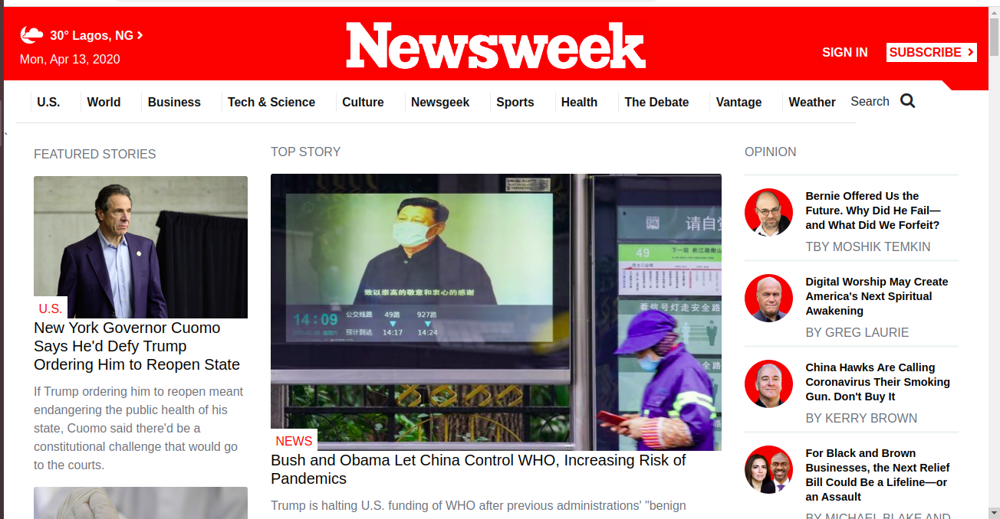

# newsweek-clone
This project is a clone of the Newsweek.com [newsweek.com](https://www.newsweek.com/) website

# Preview

# Additional description about the project and its features
 The purpose of this project is to practice building a responsive web page using bootstrap framework. The essence is to make the website appear differently in different devices depending on the device width. The features of this web page are summarized below:

## Webpage Layout
  The website has different units arranged in columns. At large screen, the three units are the Featured Stories, Top Story, and Opinion. They are arranged using bootstrap classes for extra-small screen-col-12, small-screen-col-12, medium screen-col-md, and large screen-col-lg. At extra-small screen and small screen, the page appear in one column. At medium screen, it appear in two columns, and from large screen, it appears in 3 columns. The menu or page navigation displays site logo, sign in and subscribe button, collapsible navigation button at extra small screen. At small screen it displays site logo, weather status icon and value, sign in and subscribe button, collapsible navigation. At medium screen it displays site logo, weather status icon and value, city and country name, sign in and subscribe button. From large screen, it displays site logo, weather status icon and value, city and country name, day and current date in full, sign in and subscribe button, navigation items and search button. The page is grouped into thirteen groups. They are navigation, article-group-one to article-group-nine, subscribe and newsletter section, Social media icon section and footer.
## Pictures
  The pictures captures the summary of the articles it represents.  The link below the pictures lead to the various article (though for the original website). The pictures were added using the image tag and bootstrap card class where necessary. The pictures changes automatically though(constantly updated for the original website). The sections and groups of the web page containing different pictures are laid out using CSS flex box and grid layout where necessary.
## Various Groups
  This project is categorized into thirteen groups. The groups and sections are named according to the various topics being written about. Each group was arranged using botstrap class for row and column layout, CSS grid and CSS flex box where needed. 

## Footer
  The footer contains list of different topics and articles pertaining to the website. 

## Built With
- HTML5
- CSS3
- Bootstrap4
- CSS Flex box
- CSS Grid

## Live Demo
[Live Demo Link](https://rawcdn.githack.com/Zubenna/newsweek-clone/e1bf18408430ac4a19f32d7385fc0f3415827bc7/index.html) hosted on [githack](https://raw.githack.com)

## CDNs
- https://fontawesome.com/icons
- https://stackpath.bootstrapcdn.com/bootstrap/4.4.1
- https://cdnjs.cloudflare.com/ajax/libs/font-awesome/4.7.0

## Steps For Installation
- After cloning this repo, git clone [repo](https://github.com/Zubenna/newsweek-clone/tree/feature-branch), cd into newsweek-clone folder.
- Open the index.html file in your favourite browser, and that's it!!!

## Author
- Github: [Nnamdi Emelu](https://github.com/zubenna)
- Twitter: [Nnamdi Emelu](https://twitter.com/zubenna)
- Linkedin: [Nnamdi Emelu](https://linkedin.com/in/nnamdi-emelu-08b14340/)

## 🤝 Contributing
Contributions, issues and feature requests are welcome!
Feel free to check the [issues page](issues/).

## Show your support
Give a ⭐️ if you like this project!

## Acknowledgments
- Inspiration, etc

